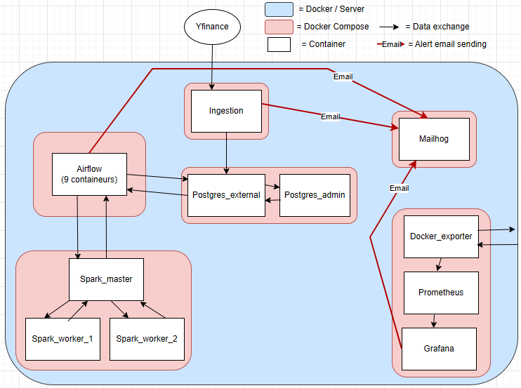
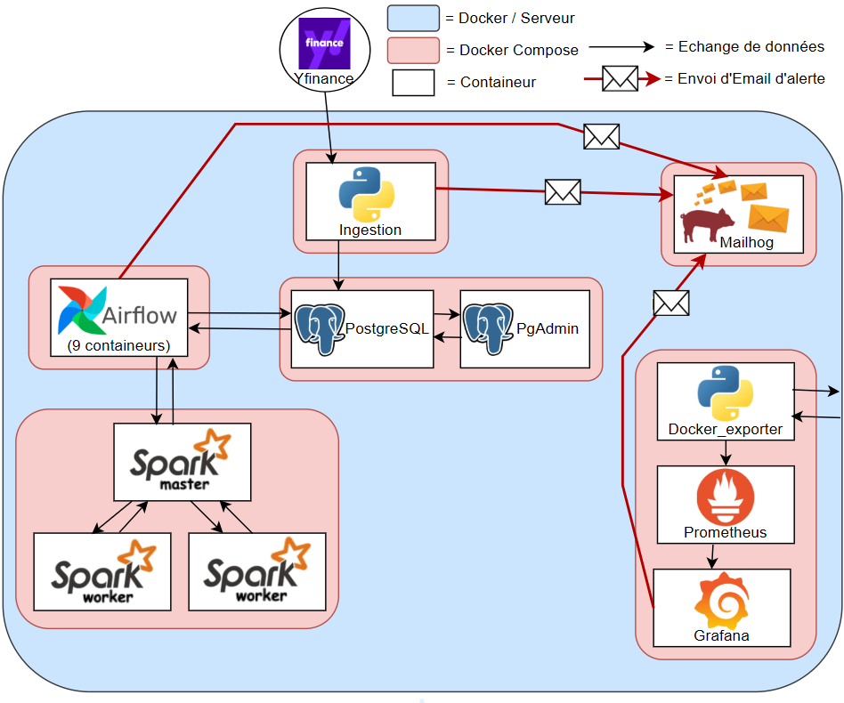
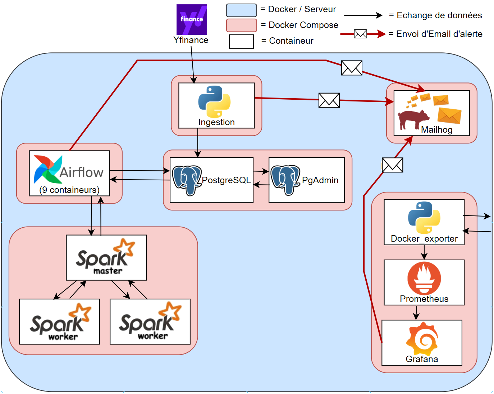
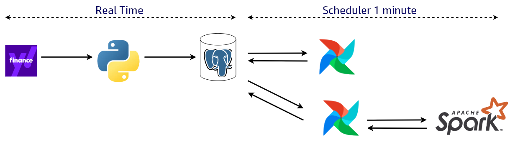
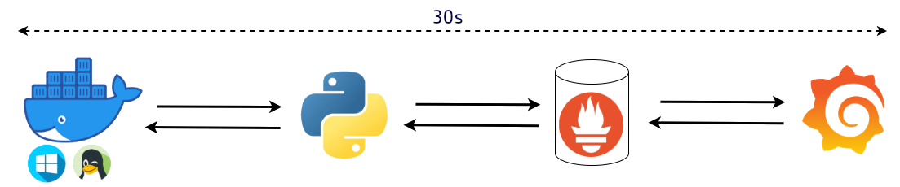
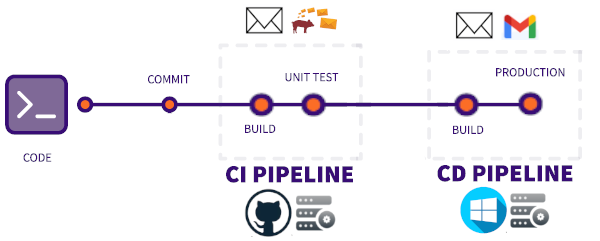
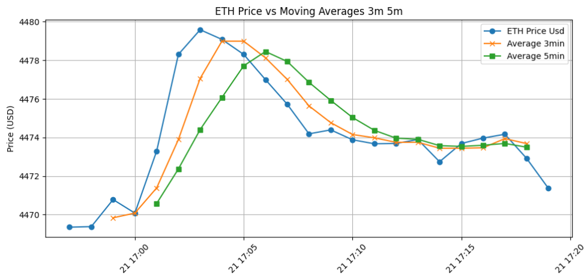
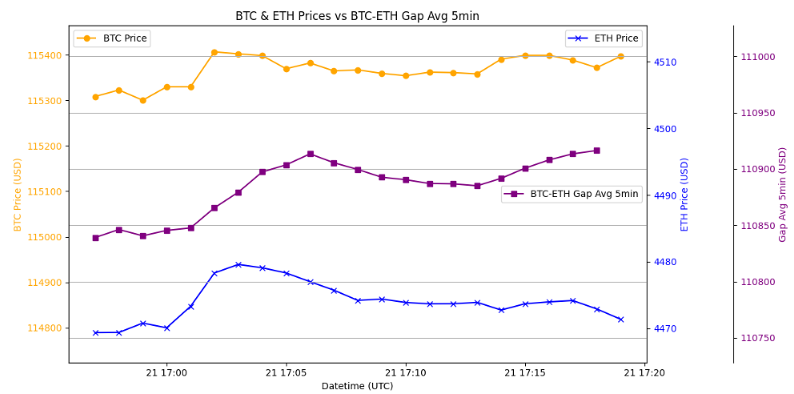

# Crypto Pipeline Airflow Spark

[](https://www.linkedin.com/in/gaetancorin/)

This project streams BTC/USD and ETH/USD data in real-time via a Python websocket ingestion system using the Yfinance library.

The collected data is stored in **PostgreSQL**, while **Airflow** orchestrates the computation of technical indicators on a **Spark** cluster.

Monitoring is handled with **Python**, **Prometheus**, and **Grafana**. 

An **email alert system** ensures notifications regarding potential problems on the ingestion pipeline, Airflow workflows or Grafana dashboards.

The GitHub Actions **CI/CD pipeline** builds containers, runs unit tests on every commit, and routes emails to Mailhog in development or Gmail in production.

## Tech Stack
- **Python**
- **PostgreSQL**
- **Airflow**
- **Spark**
- **Prometheus**
- **Grafana**
- **Mailhog**
- **Github Action**

## Global Architecture




## Data pipelines
There are two data pipelines in this project:

### BTC/USD and ETH/USD pipeline
This pipeline handles BTC/USD and ETH/USD data. Data extraction and storage are performed in **real-time using Python websockets**. Technical indicators are processed through **Airflow DAGs**, and computations are delegated to a **Spark cluster** when needed .



### Monitoring Pipeline
The second pipeline handles monitoring of **Docker containers**. A Python script collects container status, CPU usage, and memory metrics from Docker running on WSL, and exposes this data for **Prometheus storage**. **Grafana** then visualizes the metrics in interactive dashboards, with a 30-second delay between an event and its display.



## CI/CD (Continuous Integration / Continuous Deployment)

This project uses two GitHub Actions workflows for CI/CD:



#### Continuous Integration (CI) – [`streaming-CI.yml`](.github/workflows/streaming_CI.yml)
- Runs on **GitHub-hosted servers**  
- Builds the Docker containers  
- Executes all unit tests  
- Sends monitoring and alert emails to **Mailhog** to avoid spamming the production inbox  
- If all steps succeed, the workflow triggers the CD workflow  

#### Continuous Deployment (CD) – [`streaming-CD.yml`](.github/workflows/streaming_CD.yml)
- Runs on a **self-hosted Windows WSL runner**  
- Builds the containers again to ensure consistency  
- Deploys the project to the target environment  
- Sends monitoring and alert emails to **Gmail** in production  

This setup ensures that code is always tested before deployment, deployment happens in a controlled environment, and production emails are not polluted by development notifications.

# Results:
### Calculated technical indicators results:
**ETH/USD 3/5-Minute Moving Average**: Computes the moving average of ETH/USD prices over 3 or 5 minutes.

**BTC/ETH 5-Minute Gap Average**: Calculates the price difference between BTC and ETH every minute, then computes a rolling average over 5 minutes.


### Grafana Monitoring Results:


# Getting Started

This project is designed as a proof of concept to showcase my data engineering skills. 

### Pre-requisites

* docker on windows
* docker-desktop on windows
* docker-compose

### Setup and Installation

1. In Docker Desktop, go to **Settings → General** and check the box  
   **“Expose daemon on tcp://localhost:2375 without TLS”**. (for some versions, restart Docker Desktop)

2. **Clone this repository** on your Windows machine where Docker is already running  
   ```
   git clone https://github.com/gaetancorin/btc_eth_streaming_data.git
   ```

3. **Create the .env files** for each of the following folders: `airflow`, `ingestion`, `monitoring`, `postgres`:  
- Copy `.env_example` to `.env` manually into each folder (No need to modify them for the first run).

4. **Start all services** using the orchestrator script:  
  ```
  .\orchestrateur.ps1
  ```

5. **That's it ! Access the services**:
- **Postgres**: http://localhost:8081/ (Postgres default user/pass : admin@admin.com/password)
- **Airflow**: http://localhost:8080/dags (Airflow default user/pass : airflow/airflow)
- **Spark**: http://localhost:8082/
- **Docker exporter** (Python server that collects container states, CPU and memory): http://localhost:8000/
- **Prometheus**: http://localhost:9090/targets
- **Grafana**: http://localhost:3000/ (Grafana default user/pass : admin/admin)
- **Mailhog**: http://localhost:8025/

6. **Stop and remove all containers** using the clean orchestrator script: 
  ```
  .\cleanorchestrateur.ps1
  ```